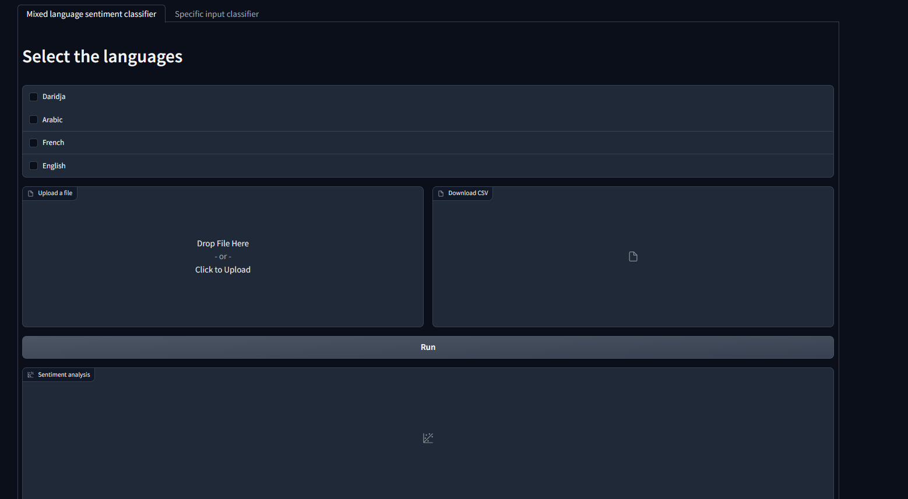
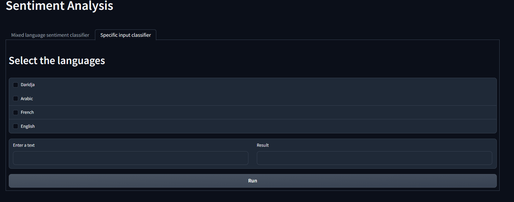

# OpenSentiment Project
This project aims to perform sentiment analysis of Open Minds Club feedbacks (Daridja or not Daridja) using natural language processing through Hugging Face transformers. It involves classifying feedback forms, social media comments, and other textual data related to the club events to positive, negative and neutral feedback. The analysis provides insights into the opinions, attitudes, and emotions expressed by the participants and helps the club make better decisions for future events.

**The project can be useful for the club in several ways:**
- Serve as a first step towards successful text mining of feedback generated by the club's events and activities involves laying a groundwork for subsequent processes such as analyzing emotions, identifying referenced content (such as speakers or activities), and summarizing the feedback.
- Help identify the strengths and weaknesses of each event and improve them accordingly.
- Masure the satisfaction and engagement level of the participants and increase their loyalty and retention.
- Help to create a positive image and reputation for the club and attract more potential members.

## Data collection
The data used in this project consists of various types of textual data, such as Daridja, Arabic, Frensh and English datasets that were mainly collected from social media posts and comments.

## Language classification
The first step in this project was to classify each feedback as either Daridja or not Daridja. This is done using a binary classifier that takes a text as input and outputs 0 for not-Daridja or 1 for Daridja.

The binary classifier was based on fine-tuning the DziriBert model which is a pretrained language model that was trained on a large corpus of Algerian dialect.

## Sentiment Analysis
The next step in this project is to perform sentiment analysis on each feedback based on its language label.

For feedbacks labeled as not Daridja like frensh, arabic or english, we use a zero-shot classifier that can perform sentiment analysis. A zero-shot classifier takes as input a text and some candidate labels (positive, negative, neutral) and outputs a probability score for each label indicating how likely it matches with the text.

The zero-shot classifier used in this project is based on facebook/bart-large-mnli model which was trained on MultiNLI dataset which contains natural language inference examples in English.

## Dashboard
The dashboard for this project is developed using Gradio, a user-friendly interface that allows users to easily interact with the sentiment analysis model. It provides a simple and intuitive way for users to upload a file and select the language for feedback analysis.

Once the user selects a language and uploads a file, the sentiment analysis model classifies the feedback into positive, negative, or neutral categories. The results are displayed in a CSV file and a chart that shows the number of positive, negative, and neutral feedbacks.

The user can also run the model in one specific example using specific input classifier where he will type his text and the model will classify it.

## Evaluation Results
The classification model of the daridja and not_daridja of the feedback was evaluated using a test dataset to measure its accuracy, precision, recall, F1 score, and loss. The evaluation results are as follows:

- **Accuracy:** 0.973939393939394
- **Precision score:** 0.9745353509366887
- **Recall score:** 0.973939393939394
- **F1 score:** 0.9739363402377113
- **Loss value:** 0.09946645796298981

